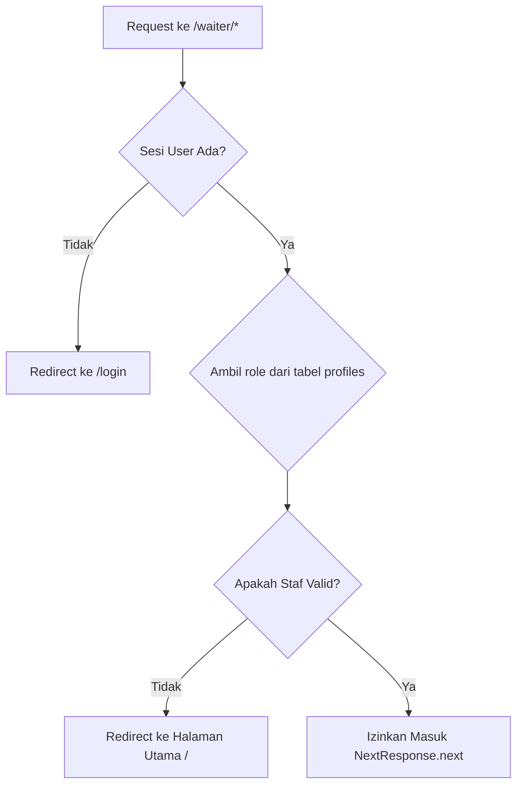

# Proxy.ts Documentation

`proxy.ts` adalah file filter routing Next.js 16 (menggantikan fungsi `middleware.ts` lama yang didepresiasi) untuk melindungi rute Command Center pramusaji (`/waiter/*`) di tingkat server. File ini memvalidasi sesi pengguna dan perannya (Role-Based Access Control / RBAC) sebelum mengizinkan halaman diakses.

---

## 1. Tujuan Utama

- **Route Guarding**: Memastikan rute `/waiter` tidak dapat diakses oleh publik atau pelanggan umum.
- **Server-side Session Check**: Memeriksa keberadaan JWT token Supabase langsung dari cookie HTTP request.
- **Role-Based Access Control (RBAC)**: Memastikan hanya user terdaftar dengan role staf (`admin`, `waiter`, `kitchen`, `barista`) yang bisa masuk.
- **Clean Redirects**: Mengarahkan pengunjung tanpa sesi ke `/login`, dan pengguna terautentikasi tanpa otorisasi staf ke halaman utama `/`.

---

## 2. Alur Logika (Why & How)

*   **Why**: Keamanan data menu dan stok sangat krusial. Jika validasi role hanya dilakukan di tingkat Client-side React, pengguna jahat dapat dengan mudah memanipulasi routing untuk membuka halaman kasir/dapur. Melakukan pencegahan langsung di tingkat server/edge routing (`proxy`) menjamin proteksi absolut.
*   **How**:
    1. Fungsi `proxy(request)` menangkap setiap request masuk yang cocok dengan matcher `/waiter/:path*`.
    2. Membuat instance `createServerClient` dari `@supabase/ssr` dengan membaca cookie request secara dinamis.
    3. Memanggil `supabase.auth.getUser()` untuk memvalidasi token sesi pengguna secara aman (mencegah pemalsuan sesi client).
    4. Jika data `user` kosong, request dialihkan (`302 Redirect`) ke halaman `/login`.
    5. Jika user ada, query tabel `profiles` dilakukan untuk mengambil peran (`role`) berdasarkan ID user.
    6. Mengevaluasi apakah `profile.role` termasuk dalam daftar peran staf (`['admin', 'waiter', 'kitchen', 'barista']`).
    7. Jika tidak cocok, request dialihkan ke halaman utama `/`.
    8. Jika semua validasi lolos, server meneruskan request (`NextResponse.next()`) ke halaman dashboard waiter.



---

## 3. Parameter & Nilai Kembalian

### `proxy(request: NextRequest): Promise<NextResponse>`
- **Parameter**:
  - `request`: Objek request Next.js yang berisi info path, cookies, dan headers.
- **Return Value**: `NextResponse` (mengizinkan akses atau melakukan redirect).

### Objek `config`
Mendefinisikan rute yang akan disaring oleh proxy:
```typescript
export const config = {
    matcher: ['/waiter/:path*'],
}
```

---

## 4. Penanganan Edge-Cases

1.  **Cookie Synchronization**:
    Ketika menggunakan client-side login, cookie harus diperbarui di request dan response secara sinkron. Library `@supabase/ssr` menggunakan helper `getAll` dan `setAll` di konfigurasi cookies untuk memastikan token refresh yang baru dapat segera ditulis kembali ke client browser melalui header response.
2.  **User Profiles Belum Sinkron**:
    Jika user baru berhasil terdaftar di `auth.users` tetapi trigger Supabase untuk membuat `public.profiles` mengalami kelambatan, database query akan mengembalikan nilai null. Sistem akan menolak akses dan mengalihkan pengguna ke halaman utama `/` untuk mencegah bypass otorisasi.
