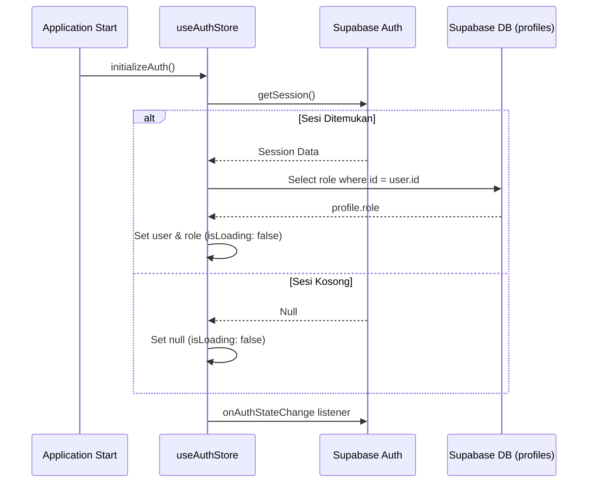

# UseAuthStore Documentation

`useAuthStore` adalah Zustand store yang mengelola sesi autentikasi dan status otorisasi peran (Role-Based Access Control) bagi seluruh kru pramusaji dan staf kafe secara client-side.

---

## 1. Tujuan Utama

- **Authentication State Source**: Menyimpan data user Supabase yang sedang login secara terpusat.
- **Role Synchronization**: Menyimpan peran/role staf (`admin`, `waiter`, `kitchen`, `barista`) untuk menentukan visibilitas UI.
- **Global Loading State**: Mengontrol indikator pemuatan selama sinkronisasi sesi awal saat aplikasi dibuka.

---

## 2. Struktur State & Properti

| Nama State / Method | Tipe Data | Keterangan |
| :--- | :--- | :--- |
| `user` | `any \| null` | Data sesi user terautentikasi dari Supabase Auth. |
| `role` | `string \| null` | Peran staf hasil sinkronisasi dari tabel `public.profiles`. |
| `isLoading` | `boolean` | Status sinkronisasi aktif saat aplikasi pertama kali dimuat. |
| `initializeAuth` | `() => void` | Menginisialisasi sesi awal dan mendengarkan event perubahan login/logout. |
| `logout` | `() => Promise<void>` | Mengakhiri sesi pengguna (Sign Out) dan membersihkan data store lokal. |

---

## 3. Alur Logika (Why & How)

### A. Real-time Auth State Listener
*   **Why**: Aplikasi harus merespon secara instan ketika user melakukan login atau logout tanpa perlu me-refresh halaman web.
*   **How**:
    1. Fungsi `initializeAuth` memanggil `supabase.auth.getSession()` untuk mengambil token login yang tersimpan di lokal (jika ada).
    2. Jika session tersedia, sistem melakukan query ke tabel `profiles` untuk mencocokkan `id` user dan membaca kolom `role`.
    3. State `user`, `role`, dan `isLoading: false` langsung diset di store.
    4. Mendaftarkan listener event perubahan via `supabase.auth.onAuthStateChange`. Listener ini akan otomatis terpicu setiap kali terjadi event login (`SIGNED_IN`), logout (`SIGNED_OUT`), atau token refresh.

---

## 4. Penanganan Edge-Cases

1.  **Profil Belum Dibuat saat Pendaftaran Baru**:
    Jika pendaftaran staf baru dilakukan secara eksternal, dan data profil belum masuk di database saat auth listener terpicu, `data?.role` akan mengembalikan `undefined`. Store secara aman akan mengatur state `role` ke `null`, yang secara otomatis menghalangi akses ke dashboard waiter.
2.  **Sesi Kadaluarsa (Token Expiry)**:
    Jika sesi token pramusaji habis saat menggunakan dashboard, listener `onAuthStateChange` akan mendeteksi event logout dan langsung menyetel `user: null, role: null`. Halaman `/waiter` yang diproteksi oleh proxy/layout akan segera melakukan redirect otomatis ke `/login`.
