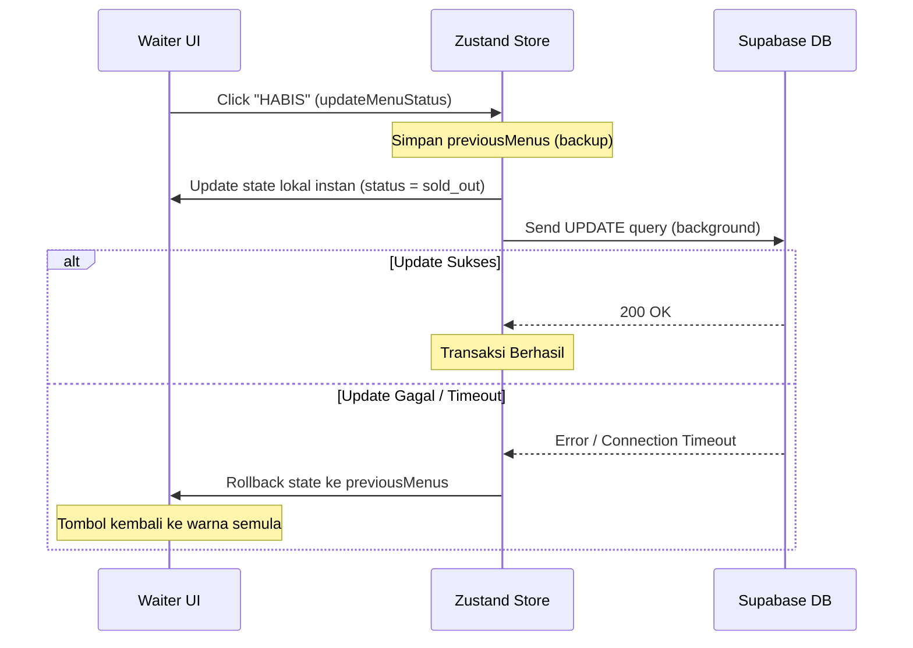

# useMenuStore Documentation

`useMenuStore` adalah Zustand store utama yang mengelola seluruh state menu makanan/minuman dan sistem pencatatan pesanan (keranjang belanja) pada aplikasi ACES Lite. Store ini mengintegrasikan pembaruan UI secara optimistic untuk performa instan dan sinkronisasi real-time via Supabase WebSocket.

---

## 1. Tujuan Utama

- **Real-time Menu State**: Menyediakan single source of truth untuk daftar menu yang sinkron di semua layar (layar pelanggan dan dashboard pramusaji).
- **1-Tap Stock Engine**: Mengizinkan pramusaji memperbarui status ketersediaan menu secara instan tanpa hambatan loading network.
- **Smart Order Note (Cart)**: Mengelola state belanja pramusaji saat mencatat pesanan pelanggan dari meja ke meja.

---

## 2. Struktur State & Properti

| Nama State / Method | Tipe Data | Keterangan |
| :--- | :--- | :--- |
| `menus` | `Menu[]` | Array berisi daftar menu makanan/minuman yang aktif. |
| `isLoading` | `boolean` | Indikator loading saat memuat data pertama kali. |
| `cart` | `CartItem[]` | Item pesanan yang sedang dicatat oleh pramusaji. |
| `tableIdentifier` | `string` | Identitas meja atau nama pemesan saat ini. |
| `setTableIdentifier` | `(table: string) => void` | Mengubah identitas meja pemesan. |
| `fetchMenus` | `() => Promise<void>` | Memuat daftar menu awal dari database Supabase. |
| `updateMenuStatus` | `(id, newStatus) => Promise<void>` | Mengubah status menu (Tersedia, Menipis, Habis) secara optimistic. |
| `subscribeToRealtime`| `() => () => void` | Mendaftarkan WebSocket listener untuk pembaruan realtime. |
| `addToCart` | `(menu: Menu) => void` | Menambahkan item menu ke dalam keranjang. |
| `removeFromCart` | `(menuId: string) => void` | Menghapus item menu tertentu dari keranjang. |
| `updateCartItemNotes`| `(menuId, notes) => void` | Menyimpan catatan kustom pada item tertentu. |
| `clearCart` | `() => void` | Mengosongkan keranjang belanja & reset identitas meja. |

---

## 3. Alur Logika Utama (Why & How)

### A. 1-Tap Stock Engine (Optimistic UI Update)
*   **Why**: Di area kafe yang sibuk, pramusaji membutuhkan waktu respon instan saat menandai menu habis agar pelanggan tidak memesan item tersebut. Menunggu request database selesai (200ms - 2s) sebelum mengubah UI akan memperlambat alur kerja.
*   **How**: 
    1. Fungsi `updateMenuStatus` menyimpan salinan state menu saat ini (`previousMenus`).
    2. Segera memperbarui state lokal `menus` di memori (<10ms) agar tombol status di layar langsung berubah warna.
    3. Mengirimkan perintah `UPDATE` ke database Supabase secara asinkron di background.
    4. Jika request Supabase sukses, data tetap bertahan. Jika gagal (misal koneksi terputus), state dikembalikan (*rollback*) ke data semula menggunakan `previousMenus`.

### B. Sinkronisasi Real-time (Supabase WebSocket Channel)
*   **Why**: Saat pramusaji mengubah status menu menjadi habis di bar/dapur, layar menu di HP pelanggan harus langsung memperbarui tampilannya tanpa perlu me-refresh halaman web secara manual.
*   **How**:
    1. Menggunakan fitur `supabase.channel` untuk mendengarkan event `UPDATE` pada tabel `menus`.
    2. Ketika ada perubahan data menu dari user mana pun (misal, update stok dari pramusaji lain), Supabase mengirimkan payload data terbaru melalui koneksi WebSocket.
    3. Fungsi callback menerima payload ini dan langsung memperbarui array `menus` lokal di store.

---

## 4. Parameter & Nilai Kembalian (Return Value)

### `updateMenuStatus(id: string, newStatus: MenuStatus): Promise<void>`
- **Parameter**:
  - `id`: ID unik menu yang ingin diubah.
  - `newStatus`: Nilai baru berupa `'available' | 'low_stock' | 'sold_out'`.
- **Return Value**: `Promise<void>`.

### `subscribeToRealtime(): () => void`
- **Parameter**: Tidak ada.
- **Return Value**: Fungsi pembersih (`() => void`) untuk memutuskan koneksi WebSocket channel (`supabase.removeChannel`). Sangat penting dipanggil di bagian pembersihan `useEffect` untuk menghindari memory leak.

---

## 5. Penanganan Edge-Cases

1.  **Kegagalan Koneksi Internet**:
    Jika pramusaji mengubah status menu saat internet putus, state lokal akan langsung terupdate (Optimistic), namun dalam hitungan detik client Supabase akan melempar error. Store akan menangkap error tersebut dan mengembalikan status menu ke kondisi semula (*rollback*), sehingga pramusaji tahu bahwa perubahan tersebut gagal disimpan ke server.
2.  **Duplikasi Event Real-time**:
    WebSocket callback hanya menargetkan update untuk ID yang berubah saja (`m.id === updatedMenu.id`), meminimalkan rendering ulang pada komponen yang tidak terpengaruh.
3.  **Catatan Pesanan Kosong**:
    Jika item ditambahkan ke keranjang, store secara cerdas mendeteksi apakah item tersebut sudah ada. Jika ada, `qty` bertambah secara kumulatif daripada membuat entri baru, mencegah kekacauan data.
